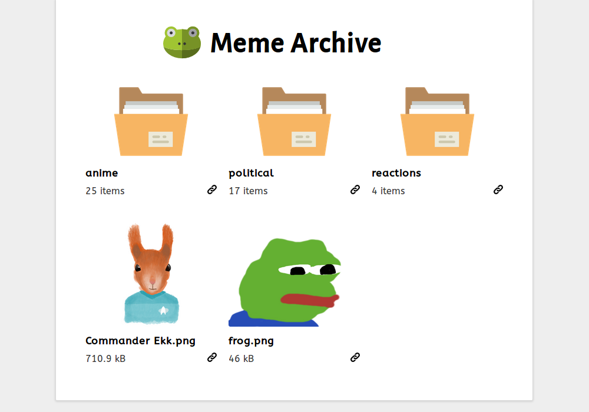

# Meme Archive

## Description

A website running on Node.js to give you quick access to all your memes! It uses
Express.js with Express Handlebars to render the pages and looks for memes in
the `/public/meme` directory. You can also use it as a normal file browser.

## Disclaimer

This project uses:

- Frog icon made by [Freepik](http://www.freepik.com) from
  [www.flaticon.com](http://www.flaticon.com), licensed under
  [CC 3.0 BY](http://creativecommons.org/licenses/by/3.0/).
- Folder and back icons made by
  [Madebyoliver](http://www.flaticon.com/authors/madebyoliver) from
  [www.flaticon.com](http://www.flaticon.com), licensed under
  [CC 3.0 BY](http://creativecommons.org/licenses/by/3.0/).
- Link icon made by
  [SimpleIcon](http://www.flaticon.com/authors/simpleicon) from
  [www.flaticon.com](http://www.flaticon.com), licensed under
  [CC 3.0 BY](http://creativecommons.org/licenses/by/3.0/).
- Alegreya Sans font made by Juan Pablo del Peral under the SIL Open Font
  License, Version 1.1.
- ABeeZee Regular font made by Anja Meiners under the SIL Open Font License,
  Version 1.1.
